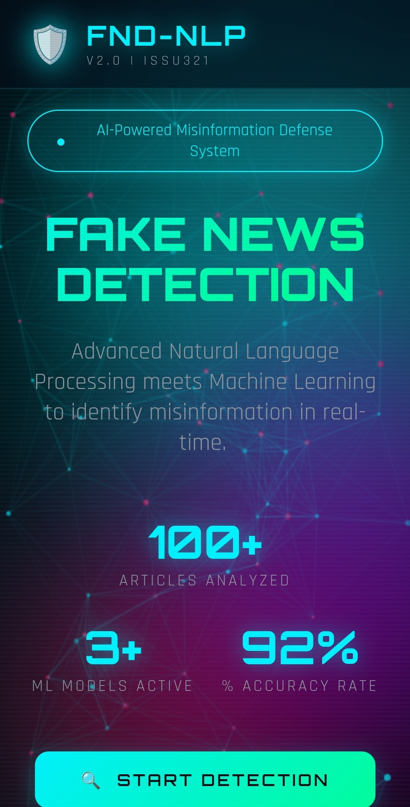
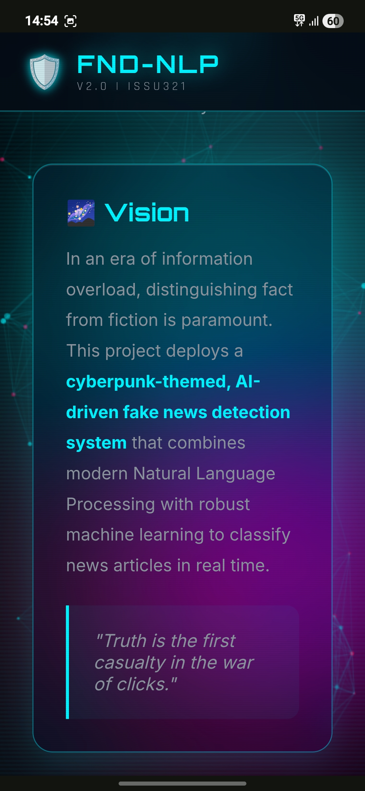
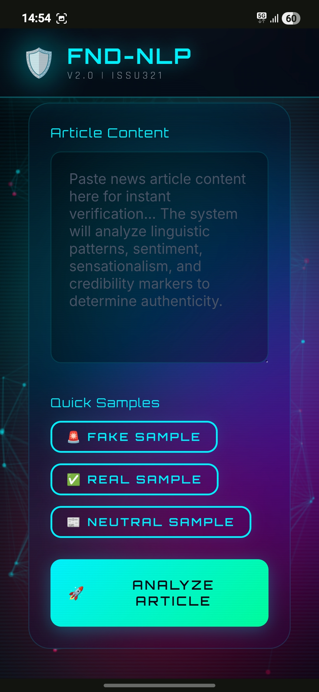

<p align="center">
  
  
  
  
</p>

<h1 align="center">
  <span style="color: #00f3ff; text-shadow: 0 0 10px #00f3ff;">🛡️ FAKE NEWS DETECTION USING NLP</span>
</h1>

<p align="center">
  <em>AI-Powered Misinformation Defense System</em><br>
  <strong>Developed by <a href="https://github.com/issu321">issu321</a></strong>
</p>

---

## 🌌 Vision

In an era of information overload, distinguishing fact from fiction is paramount. This project deploys a **cyberpunk-themed, AI-driven fake news detection system** that combines modern Natural Language Processing with robust machine learning to classify news articles in real time.

> *"Truth is the first casualty in the war of clicks."*

---

## ✨ Features

| Feature | Description |
|---------|-------------|
| 🔍 **Real-Time Detection** | Classify articles as Fake or Genuine with confidence scores |
| 🧠 **NLP Pipeline** | Lowercasing, tokenization, stopword removal, stemming, TF-IDF |
| 💬 **Sentiment Analysis** | Polarity and subjectivity scoring via TextBlob |
| 🤖 **Model Comparison** | Train and benchmark Logistic Regression, Random Forest, Naive Bayes |
| 📊 **Interactive Dashboard** | Plotly-powered analytics with keyword frequency |
| 🧾 **Batch Processing** | Upload CSV files for bulk prediction and download results |
| 🔮 **AI Explanation Engine** | Human-readable reasoning for every classification |
| 🎨 **Cyberpunk UI** | Neon-styled dark interface with glowing panels |

---

## 🚀 Installation

### Windows

```powershell
# Clone the repository
git clone https://github.com/issu321/Fake-News-Detection-Using-NLP.git
cd Fake-News-Detection-Using-NLP

# Run installer
install.bat
```

### Linux / macOS

```bash
# Clone the repository
git clone https://github.com/issu321/Fake-News-Detection-Using-NLP.git
cd Fake-News-Detection-Using-NLP

# Make executable and run
chmod +x install.sh
./install.sh
```

### Manual Setup

```bash
python3 -m venv venv
source venv/bin/activate  # Windows: venv\Scripts\activate
pip install -r requirements.txt
streamlit run app.py
```

---

## 🖥️ Usage

1. **Launch the application** — Streamlit will open in your browser at `http://localhost:8501`
2. **Navigate via sidebar** — Home, Detect, Dashboard, Models, Batch
3. **Analyze an article** — Paste text or enter title + body, then click *Analyze Article*
4. **Review the explanation** — The AI engine explains why the article was classified as fake or real
5. **Explore the dashboard** — View dataset distributions, model performance, and keyword analytics
6. **Batch upload** — Drop a CSV with a `text` column to analyze multiple articles at once

---

## 📸 Screenshots

> Placeholder sections for your portfolio:

| Home | Detection | Dashboard |
|------|-----------|-----------|
|  |  |  |

---

## 🔬 NLP Pipeline

```
Raw Text
   ↓
Lowercase + Regex Cleaning
   ↓
Tokenization (NLTK)
   ↓
Stopword Removal
   ↓
Porter Stemming
   ↓
TF-IDF Vectorization (1-2 grams, 5k features)
   ↓
ML Model Prediction
```

---

## 🤖 Machine Learning Architecture

| Model | Role | Strengths |
|-------|------|-----------|
| **Logistic Regression** | Baseline linear classifier | Fast, interpretable coefficients |
| **Random Forest** | Ensemble tree classifier | Handles non-linear patterns, robust |
| **Multinomial Naive Bayes** | Probabilistic classifier | Excellent for text, low variance |

The system **automatically selects the best model** by F1-score and persists it with `joblib` for instant inference.

---

## 📁 Folder Structure

```
Fake-News-Detection-Using-NLP/
│
├── app.py                  # Main Streamlit application
├── requirements.txt        # Python dependencies
├── README.md               # Project documentation
├── install.sh              # Linux/macOS installer
├── install.bat             # Windows installer
├── inputguide.md           # Usage and input examples
├── news_dataset.csv        # Balanced educational dataset (100 rows)
├── .gitignore              # Git ignore rules
└── assets/
    └── styles.css          # Cyberpunk custom styling
```

---

## 🛠️ Technologies Used

- **Python 3.11+**
- **Streamlit** — Frontend framework
- **scikit-learn** — Machine learning toolkit
- **NLTK** — Tokenization, stemming, stopwords
- **TextBlob** — Sentiment polarity analysis
- **Plotly** — Interactive visualizations
- **joblib** — Model serialization
- **pandas / numpy** — Data processing

---

## 🔮 Future Roadmap

- [ ] Deep Learning integration (LSTM / BERT)
- [ ] Chrome extension for on-page detection
- [ ] REST API deployment with FastAPI
- [ ] Multi-language support
- [ ] Real-time news feed monitoring
- [ ] Explainable AI with SHAP values

---

## 🤝 Contributing

Contributions are welcome! Please fork the repository and submit a pull request.

1. Fork the project
2. Create your feature branch (`git checkout -b feature/amazing-feature`)
3. Commit your changes (`git commit -m 'Add amazing feature'`)
4. Push to the branch (`git push origin feature/amazing-feature`)
5. Open a Pull Request

---

## 📜 License

This project is released under the **MIT License** for educational and portfolio purposes.

---

<p align="center">
  <strong>Developed by <a href="https://github.com/issu321">issu321</a></strong><br>
  <span style="color: #8b949e;">© 2026 Fake News Detection Using NLP</span>
</p>
